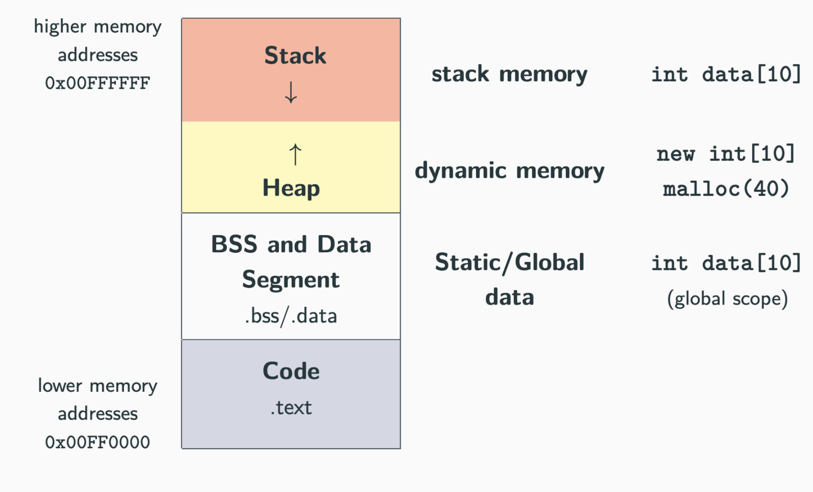

# Memory Layout and Pointers
> 🚧 This article is currently being written. Check back soon!

## Overview

This chapter introduces the core ideas behind memory management, memory layout, pointers, and references in modern C++.

## Prerequisites

- Basic C++ knowledge
- Familiarity with basic C/C++ syntax

## Topics Covered

- Memory layout and storage duration (Text, Data, Stack, Heap)
- Pointers, references, and pointer arithmetic
- Dynamic allocation with `new`, `malloc`, and `delete`
- Memory leaks and dangling pointers
- Passing arguments (Value vs. Reference vs. Pointer)
- Placement `new` (Advanced allocation)
---

## Memory Layout

A C++ program's memory is divided into distinct regions:



### Text Segment
It stores the program’s compiled machine code, which means the whole instructions of the program are stored here. For example:
*Assembly*
```asm
add r1, r2, r0;
mul r3, r4, r5;
```

### Data Segment
It stores the global and static variables. It is divided into two parts:

**Initialized Data Segment**
Those global and static variables which are assigned a value at declaration.

**Uninitialized Data Segment (BSS)**
Those global and static variables which have not been explicitly initialized. They are automatically set to zero at run time.


### Stack
Data stored in the stack includes:
- **Local variables:** Variables in a local scope.
- **Function arguments:** Data passed from a caller to a function.
- **Return addresses:** Data passed from a function back to its caller.

**Important:**
1. Every object that resides in the stack is not valid outside its scope.
2. Whenever a function is called, a stack frame is pushed to the stack which includes the return address, parameters, etc. When the function finishes, its frame is popped off.
3. Only global and static variables are automatically initialized to zero. Local variables declared inside functions are stored in the stack and contain garbage values unless explicitly initialized.


### Heap
It is a memory region used for dynamic memory allocation at run time.
Dynamic memory allocation is done using the keywords `new`, `malloc`, `calloc`.


### Stack vs Heap

**Size**
The heap uses the concept of virtual memory (covered in OS), so we can allocate as much memory as needed until the system runs out, while the stack size is limited. So basically, Stack size < Heap size. A stack overflow occurs if the stack does not have the required space, while `new` throws a `std::bad_alloc` exception when the heap runs out of memory.


**Time**
Let's suppose:
```cpp
struct Student {
    int id;
    double marks;
};

int main() {
    int num = 1;
    Student* p = new Student;
    p->id = 101;
    p->marks = 95.5;

    delete p;
}
```
**Memory view:**

Here, `num` is on the stack.
Here, the pointer `p` is created on the stack, which stores the address (let's say 0x5000), but the actual data is stored in the heap.
So, in the stack we occupy 8 bytes to store the address (assuming a 64-bit system), and in the heap, we have 4 + 4 (padding discussed later) + 8 = 16 bytes.

Now, when we require the `num` variable, the compiler knows `num` is at stack offset `-4` (there is a stack pointer, and the offset is from that). So, the compiler will replace the instruction with an assembly instruction like *store n1, 1* (just for understanding, where `n1 = stack pointer - 4`), which takes fewer CPU cycles. While for the heap, if someone has to read `p->id`, first it has to read the address stored in `p` (which is in the stack), then it has to go to that address, add the required offset, and then read it, which requires more CPU cycles.

Heap access time is more than stack access time.


**Cache Locality**

*Allocation*
When another local variable has to be pushed to the stack, the stack pointer moves, so new variables are placed next to the previous stack data. While in heap allocation, the allocator searches for free blocks, so a new object may go anywhere; therefore, memory may become scattered. For example:
Let's say heap memory looks like this: 
`[used][free][used][free][used]`. Then, the next time `new` is called, it may go to the second block, and the time after that it may go to the fourth block (so it is not contiguous).

*Important:*
Heap is contiguous within a single allocation, but fragmented between different allocations. For example, in a `std::vector` which is dynamically allocated, `v[0]` and `v[1]` are contiguous (let's assume `int`, so `v[0]` and `v[1]` are at `address` and `address + 4` respectively).

The stack is more cache-friendly than the heap.
```cpp
int num = 1;  // stack ptr - 4
int x = 10;   // stack ptr - 8
int y = 20;   // stack ptr - 12
int z = 30;   // stack ptr - 16
```
In memory, all those variables are very close, so a cache hit will occur.

While:
```cpp
Student* a = new Student;
Student* b = new Student;
Student* c = new Student;
```
In memory, all those variables may be at different addresses, so a cache miss might occur.

**Life Time**
The stack is usually tied to function scope, while heap memory has to be explicitly deleted by the programmer.


### Examples

```cpp
int data[] = {1, 2}; // DATA segment memory
int big_data[1000000] = {}; // BSS segment memory
// (zero-initialized)

int main() {
    int A[] = {1, 2, 3}; // Stack memory
}
```

```cpp
int x = 3; // Not on the stack (Data segment)
struct A {
    int k; // Depends on where the instance of A is created
};

int main() {
    int y = 3; // On stack
    char z[] = "abc"; // On stack
    A a; // On stack (also k)
    void* ptr = malloc(4); // Variable "ptr" is on the stack, data is on the heap
}
```


**Question**
Why is BSS required?
When the compiler builds your program, it calculates the total size of all your uninitialized global variables. Instead of writing millions of zero-initialization instructions in the executable file, it just creates the `.bss` header in the binary file. So it saves a lot of space in the binary file (`.exe` file). The Hard Disk (or SSD) is where your binary file is stored when the program is closed. Hard disk space is valuable, and reading from it is physically slow. If `.bss` DID NOT exist:
The compiler would be forced to generate 100 Megabytes of literal zeros (00000000...) and save them permanently inside your `.exe` file on the hard disk. Your simple program would instantly take up 100 MB of your hard drive space, just to store "nothing."


```cpp
int x; // Uninitialized global so compiler stores it in .bss 

int main() {
    x = 10; // Runtime Assignment
    // Even though it is initialized at runtime here, it will still be in .bss, 
    // as .bss, .text segment, and .data segment locations are decided during compile time.
    return 0;
}
```


### Heap Memory — `new` vs `malloc`

`new`/`new[]` and `delete`/`delete[]` are C++ keywords that perform dynamic memory allocation/deallocation and object construction/destruction at runtime.

`malloc` and `free` are C functions, and they only allocate and free memory blocks (expressed in bytes).

> [!TIP]
> - `free()`, `delete`, and `delete[]` applied to `NULL` / `nullptr` pointers **do not produce errors** (they safely do nothing).
> - **Mixing** `new`, `new[]`, and `malloc` with something different from their counterparts (e.g., allocating with `new[]` and deallocating with `free()`) leads to **undefined behavior**.

```cpp
// Allocate a single element
int* value = (int*) malloc(sizeof(int)); // C
int* value = new int;                    // C++

// Allocate N elements
int* array = (int*) malloc(N * sizeof(int)); // C
int* array = new int[N];                     // C++

// Allocate N structures
MyStruct* array = (MyStruct*) malloc(N * sizeof(MyStruct)); // C
MyStruct* array = new MyStruct[N];                          // C++

// Allocate and zero-initialize N elements
int* array = (int*) calloc(N, sizeof(int)); // C
int* array = new int[N]();                  // C++

// Deallocate a single element
int* value = (int*) malloc(sizeof(int)); // C
free(value);

int* value = new int; // C++
delete value;

// Deallocate N elements
int* value = (int*) malloc(N * sizeof(int)); // C
free(value);

int* value = new int[N]; // C++
delete[] value;
```

### What `new` does and its difference from `malloc()`

- **Return type:** `new` returns a pointer of the required type, while `malloc()` returns a `void*` (which must be cast in C++).
- **Failure:** `new` throws a `std::bad_alloc` exception on failure (unless `std::nothrow` is used), whereas `malloc()` returns `NULL` / `nullptr`.
- **Allocation size:** With `new`, the compiler automatically determines the required size of the object. With `malloc()`, the programmer must explicitly specify the number of bytes using `sizeof()`.
- **Initialization:** `new` allocates memory and calls the constructor, allowing the object to be initialized. `malloc()` only allocates raw memory and does not call constructors.
- **Destruction:** Memory allocated with `new` must be released using `delete`, which also calls the object's destructor. Memory allocated with `malloc()` must be released using `free()`, which does not call destructors.
- **Polymorphism:** Objects with virtual functions should be created using `new` (or by normal object construction), because constructors initialize the object's virtual table pointer (`vptr`). `malloc()` only allocates raw memory and does not call constructors, so the object is not properly constructed. Calling virtual functions on such an object results in undefined behavior.

> **Note:** Do not worry if you don't know much about Object-Oriented Programming (OOP) yet. You can come back to this point after covering the OOP chapter!

```cpp
#include <iostream>

class Base {
public:
    Base() {
        std::cout << "Constructor\n";
    }

    virtual void show() {
        std::cout << "Base\n";
    }

    ~Base() {
        std::cout << "Destructor\n";
    }
};

int main() {
    Base* p1 = new Base;   // Constructor is called
    p1->show();
    delete p1;             // Destructor is called

    Base* p2 = (Base*)malloc(sizeof(Base)); // Only raw memory allocated
    // p2->show();         // Undefined behavior!
    free(p2);              // No destructor is called
}
```

### Allocation Metadata & `delete`

The compiler knows the `sizeof(Student)`, so with the `new` statement, it allocates the required memory (e.g., 16 bytes) and then calls the constructor. `operator new()` usually calls the system's memory allocator. However, memory allocators don't simply return raw memory. Instead, they maintain some metadata. A hidden header is managed by the allocator, which contains the size of the allocation.

#### What happens when you call `delete`?
```cpp
delete p;
```
This performs two operations:

1. **Destructor is called:**
   `p->~Student();`

2. **Memory is deallocated:**
   The allocator’s metadata header (which stored the size of the allocation) is consulted. The memory manager reclaims the bytes and adds them back to the heap's free list. 

Similarly, for arrays:
```cpp
Student* p = new Student[3];
```
```text
+-------------------+-----------------------------+
| Count = 3         | Student | Student | Student |
+-------------------+-----------------------------+
                    ^
                    |
                    p
```

### Quick Question

**Q-2: What is the output of this program?**
```cpp
int *p = new int[10];
p++;
delete[] p;
```

**Answer:**
This code results in **undefined behavior**. 

`p++` increments `p` by 1. Since the pointer at address `p + 1` was not the original base address returned by `new[]`, passing it to `delete[]` causes undefined behavior during runtime. The memory allocator attempts to find the metadata header at `(p + 1) - header_offset`, reading garbage data and likely crashing the program.

### Quick Question

**Q-3: What is the difference between `delete` and `delete[]`? What happens if you use one where the other was expected?**

**Answer:**
- `delete` is used to deallocate a single object allocated with `new`.
- `delete[]` is used to deallocate an array of objects allocated with `new[]`.

If you use `delete` on an array, or `delete[]` on a single object, it results in **undefined behavior**. Usually, using `delete` on an array of objects only calls the destructor for the *first* element, leaking the rest (or outright crashing the program).

```cpp
class Student {
public:
    Student() { std::cout << "Constructor\n"; }
    ~Student() { std::cout << "Destructor\n"; }
};

int main() {
    // CORRECT usage:
    Student* s = new Student;
    delete s; // Calls destructor once

    Student* arr = new Student[3];
    delete[] arr; // Calls destructor 3 times

    // INCORRECT usage (Undefined Behavior!):
    Student* bad_arr = new Student[3];
    delete bad_arr; // BUG: Only calls destructor for the 1st student!

    return 0;
}
```
### Pointer Fundamentals

**Pointer (`T*`)**
A pointer is a variable referring to a location in memory.

**Pointer Dereferencing (`*ptr`)**
Pointer dereferencing means obtaining the value stored at the location referred to by the pointer.

**Address-of Operator (`&`)**
The address-of operator returns the memory address of a variable.

```cpp
int a = 3;
int* b = &a; // address-of operator
// 'b' is equal to the address of 'a'

a++;
std::cout << *b; // prints 4
```
> **Note:** Be careful not to confuse the address-of operator (`&`) with the reference syntax (`T& var = ...`).

#### `struct` Member Access
- The dot (`.`) operator is applied to local objects and references.
- The arrow (`->`) operator is used with a pointer to an object.

```cpp
struct A {
    int x;
};

A a;         // local object
a.x = 10;    // dot syntax

A* ptr = &a; // pointer
ptr->x = 20; // arrow syntax: same as (*ptr).x
```

#### Pointer Arithmetic

> [!IMPORTANT]
> **Pointer Arithmetic Rule:**  
> `address(ptr + i) = address(ptr) + (sizeof(T) * i)`  
> *(where `T` is the type of elements pointed to by `ptr`)*

**Subscript Operator (`[]`)**
The expression `ptr[i]` is mathematically identical to `*(ptr + i)`. 
> **Note:** Because it is just pointer addition under the hood, the subscript operator in C++ also accepts *negative* values!

```cpp
int array[4] = {1, 2, 3, 4};

std::cout << array[1];       // prints 2
std::cout << *(array + 1);   // prints 2

std::cout << array;          // prints memory address (e.g., 0xFFFAFFF2)
std::cout << array + 1;      // prints address + sizeof(int) (e.g., 0xFFFAFFF6)

int* ptr = array + 2;
std::cout << ptr[-1];        // prints 2 (equivalent to *(ptr - 1))
```

### Quick Question

**Q-4: What is the output of the following program?**

```cpp
#include <iostream>
using namespace std;

int main() {
    char str[] = "ABCDEFGHIJKLMNOP";   // 16 characters

    // Cast the char pointer to an int pointer
    int* p = reinterpret_cast<int*>(str);

    // Increment the int pointer
    p += 2;

    // Cast back to a char pointer
    char* q = reinterpret_cast<char*>(p);

    cout << *q << endl;

    return 0;
}
```

**Answer:**
The output is **`I`**.

Initially, `p` points to the address of `'A'`. Since `p` is an `int*`, it points to objects of type `int` (which is typically 4 bytes). Applying the pointer arithmetic rule:  
`address(ptr + i) = address(ptr) + (sizeof(T) * i)`

So, `p += 2` moves the pointer by `2 * sizeof(int)` = **8 bytes**, not 2 bytes.  
Counting 8 characters forward from `'A'` (where `'A'` is index 0), the 8th index is the character `'I'`.

#### Memory Leaks and Dangling Pointers

**Memory Leak**
A memory leak occurs when dynamically allocated memory is not deallocated after use, leading to increased memory consumption, reduced performance, and potentially application crashes due to exhaustion of available memory.

```cpp
int main() {
    int* array = new int[10];
    array = nullptr; // memory leak!!
} // the memory can no longer be deallocated!!
```

**Dangling Pointer**
A dangling pointer points to a deallocated memory region. Accessing it is extremely dangerous.

```cpp
int* array = new int[10];

delete[] array; // OK -> "array" is now a dangling pointer

*array = 5;     // POTENTIAL SEGMENTATION FAULT!
delete[] array; // DOUBLE FREE CORRUPTION!
```
> **Note:** What happens if we call `delete` two times on an array? As shown above, this results in **Double Free Corruption**, crashing your program.

### References (`T&`)

A reference is an alias (another name) for an existing variable. It does not create a new object or allocate new memory; instead, it refers to the exact same memory location as the original variable. Any change made through the reference directly affects the original variable.

> [!IMPORTANT]
> 1. A pointer has its own memory address and size on the stack. A reference structurally shares the same memory address as the original variable.
> 2. The compiler may internally implement references as pointers under the hood, but the language treats them completely differently.
> 3. References allow for better compiler optimizations because they must be initialized, cannot be null, and cannot be reseated. This lets the compiler eliminate the hidden pointer entirely and keep values in registers longer.

For example:
```cpp
int a = 10;
int& r = a;

r++;
```
Because of compiler optimization (the compiler strictly knows `r` always refers to `a`), it behaves perfectly as if you had written:
```cpp
a++;
```

#### References vs Pointers

- **Nullability:** References cannot have a `NULL` value. A reference is *always* connected to valid storage.
- **Reseating:** References cannot be changed. Once initialized, a reference cannot be "re-pointed" to refer to another object. Pointers, however, can point to different objects at any time.
- **Initialization:** References *must* be initialized when they are created. Pointers can be declared uninitialized and assigned later.

#### Examples
```cpp
// int& a;       // COMPILE ERROR: requires initialization
// int& b = 3;   // COMPILE ERROR: cannot bind non-const reference to rvalue literal

int c = 2;
int& d = c;      // OK: valid initialization
int& e = d;      // OK: reference to reference collapses into a reference to 'c'

++d;             // increments 'c' to 3
++e;             // increments 'c' to 4
std::cout << c;  // prints 4

int a = 3;
int* b = &a;     // pointer
int* c_ptr = &a; // pointer (renamed from c to avoid collision)

++b;             // changes the memory address the pointer 'b' holds
++(*c_ptr);      // changes the value of 'a' (a = 4)

int& ref = a;    // reference
++ref;           // changes the value of 'a' (a = 5)
```

### Quick Questions

**Q-5: What is the output of the following program (on a 64-bit system)?**
```cpp
#include <iostream>
using namespace std;

int main() {
    int x = 10;
    int& r = x;
    int* p = &x;

    cout << sizeof(r) << " " << sizeof(p) << endl;
}
```
**Answer:** DIY (Do It Yourself)

---

**Q-6: What is the output of this program?**
```cpp
int& fun() {
    int x = 10;
    return x;   
}

int main() {
    int& r = fun();
    cout << r;
    return 0;
}
```
**Answer:** DIY (Do It Yourself)

---

**Q-7: What is the output of this program?**
```cpp
#include <iostream>
using namespace std;

int x = 10;   // global variable

int& fun() {
    return x;  // returning reference to global variable
}

int main() {
    fun() = 12;
    cout << fun();
    return 0;
}
```
**Answer:** DIY (Do It Yourself)

### Passing Arguments: Value vs. Reference vs. Pointer

#### Pass by Value
- A new copy of the data is created in the function's memory.
- The original variable and the function parameter have entirely different memory locations.
- Changes affect only the copy, not the original data.
- For large objects, this can be expensive because copying takes both time and memory.

#### Pass by Reference
- No new object is created.
- The function parameter becomes an alias of the original object.
- Both refer to the exact same memory location.
- Changes directly modify the original object.
- This is highly efficient for large objects because no copy is made.

> [!TIP]
> **Practice:** Analyze the following examples to reinforce the difference between passing pointers and references.

```cpp
void f(int* value) {} // 'value' is a pointer, can be nullptr
void g(int& value) {} // 'value' is a reference, must always point to a valid object

int a = 3;

f(&a);      // OK: passing the address of 'a'
f(nullptr); // OK: passing null to a pointer
// f(a);    // COMPILE ERROR: 'a' is an int, not a pointer

g(a);       // OK: passing 'a' by reference
// g(3);    // COMPILE ERROR: cannot bind non-const reference to an rvalue literal
// g(&a);   // COMPILE ERROR: '&a' is a pointer, not a reference
```

```cpp
#include <iostream>
using namespace std;

void modifyPointer(int* p) {
    p = nullptr; 
}

void modifyReference(int& r) {
    r = 100;     
}

int main() {
    int x = 10;
    int* ptr = &x;

    modifyPointer(ptr);
    cout << *ptr << endl; 

    modifyReference(x);
    cout << x << endl;    
    
    return 0;
}
```

### Placement `new` (For Quant,not for SDE )

Placement `new` allows us to construct an object at a specific, pre-allocated memory address. **It does not allocate memory.** The memory must be allocated beforehand by the programmer.

#### Normal `new` vs. Placement `new`

**Normal `new`**
```cpp
Student* s = new Student;
```
Does two things:
1. Allocates memory (usually on the heap)
2. Constructs the object

*Memory Ownership:*
- `new` → allocates memory + constructs object
- `delete` → destroys object + frees memory

**Placement `new`**
```cpp
new(address) Type;
```
Does only **one** thing:
1. Constructs the object at the given address

*Memory Ownership:*
1. You allocate the memory manually.
2. Placement `new` constructs the object in that space.
3. You manage the object's lifetime and destruction manually.

#### Syntax
```cpp
Type* ptr = new(memory_address) Type(arguments);
```

#### Example
```cpp
char buffer[sizeof(int)];
int* x = new(buffer) int(10);
```

**Memory Representation:**
```text
Stack

buffer
+-------------+
| int object  |
| value = 10  |
+-------------+
      ^
      |
 x points here
```
The `int` is created safely inside the pre-allocated `buffer`.

#### Why is Placement `new` Required?

**To avoid repeated heap allocations.**

Heap allocation is computationally expensive. Instead of repeatedly going through the cycle of `allocate → construct → destroy → allocate again`, we can optimize performance by:
1. Allocating a large block of memory once.
2. Constructing objects inside that memory space only when needed.

#### Important: Destructor Handling

For objects that have destructors, you must handle destruction manually:

```cpp
struct A {
    ~A() {
        cout << "destroyed";
    }
};

char buffer[sizeof(A)];
A* obj = new(buffer) A();
```

> [!WARNING]
> You **cannot** use `delete obj;` ❌
> This is because the memory was not allocated by standard `new`. Using `delete` here would lead to undefined behavior.

You must **call the destructor manually**:
```cpp
obj->~A();
```
Then, you can safely release or reuse the underlying memory separately.

Few examples :
```cpp
// STACK MEMORY
char buffer[8];
int* x = new (buffer) int;
short* y = new (x + 1) short[2];
// no need to deallocate x, y
// HEAP MEMORY
unsigned* buffer2 = new unsigned[2];
double* z = new (buffer2) double;
delete[] buffer2; // ok
// delete[] z; // ok, but bad practice
```
---
*Last updated: July 2026*
